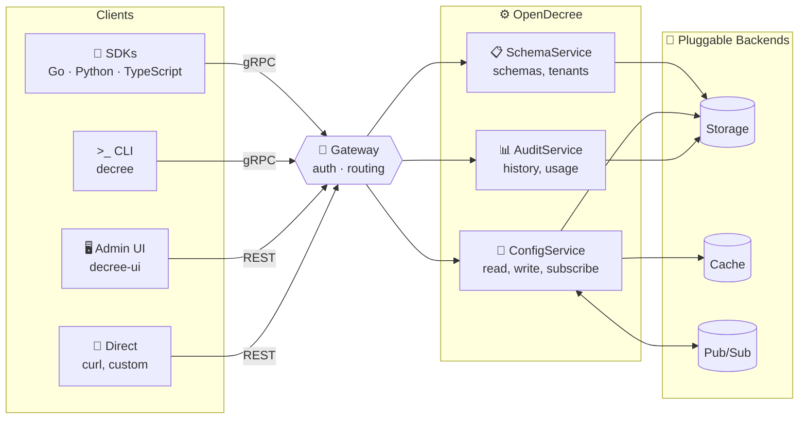

<p align="center">
  
</p>

<h1 align="center">OpenDecree</h1>

<p align="center">
  <a href="https://github.com/opendecree/decree/actions/workflows/ci.yml"></a>
  <a href="https://github.com/opendecree/decree/releases"></a>
  <a href="https://pkg.go.dev/github.com/opendecree/decree"></a>
  <a href="LICENSE"></a>
  <a href="https://codecov.io/gh/opendecree/decree"></a>
</p>
<p align="center">
  <a href="https://codespaces.new/opendecree/decree"></a>
</p>

<p align="center"><strong>Stop hard-coding fees, limits, and business rules — and redeploying every time one changes.</strong></p>

<p align="center">Define your business-config schema once and get validation, gRPC + REST APIs, type-safe SDKs, an admin UI, and a full audit trail — automatically.</p>

<p align="center"><em>Typed business configuration: the layer between feature flags and infrastructure config.</em></p>

> **Alpha Software** — OpenDecree is under active development. APIs, proto definitions, configuration formats, and behavior may change without notice between versions. Not recommended for production use yet.

<p align="center">
  
</p>

---

## Schema → APIs → SDKs

Write a schema once:

```yaml
# payments.decree.schema.yaml
fields:
  payments.fee:
    type: number
    constraints:
      min: 0.0
      max: 1.0
  payments.retries:
    type: integer
    constraints:
      min: 1
      max: 10
  payments.enabled:
    type: bool
```

Get typed, validated reads in every language:

```go
// Go
client := grpctransport.NewConfigClient(conn, grpctransport.WithSubject("myapp"))
fee, _     := client.GetFloat(ctx, tenantID, "payments.fee")     // float64
retries, _ := client.GetInt(ctx, tenantID, "payments.retries")   // int64
enabled, _ := client.GetBool(ctx, tenantID, "payments.enabled")  // bool
```

```python
# Python
with ConfigClient("localhost:9090", subject="myapp") as client:
    fee     = client.get(tenant_id, "payments.fee", float)
    retries = client.get(tenant_id, "payments.retries", int)
    enabled = client.get(tenant_id, "payments.enabled", bool)
```

```typescript
// TypeScript
const client = new ConfigClient("localhost:9090", { subject: "myapp" });
const fee     = await client.get(tenantId, "payments.fee", Number);
const retries = await client.get(tenantId, "payments.retries", Number);
const enabled = await client.get(tenantId, "payments.enabled", Boolean);
```

<p align="center">
  
  
  
  
  
</p>

---

## Why OpenDecree?

OpenDecree manages **business-oriented configuration** — approval rules, fee structures, settlement windows, feature parameters: the config that lives between your infrastructure settings and your application code. It sits between feature flags (release toggles) and infrastructure config (low-level key-value), purpose-built for **typed business configuration**.

| Capability | Feature Flags | Infrastructure Config\* | **OpenDecree** |
|---|---|---|---|
| Typed values | bool / variant only | strings only | ✓ native types (int, number, string, bool, time, duration, url, json) |
| Schema validation | ✗ | ✗ | ✓ constraints + JSON Schema, enforced on every write |
| Multi-tenant | limited (segments) | ✗ | ✓ first-class, with field-level locking |
| Audit trail | limited | ✗ | ✓ full who/what/when/why history |
| Real-time updates | ✓ SDK polling/SSE | ✓ watch APIs | ✓ gRPC streaming subscriptions |
| Admin UI | ✓ (vendor-hosted) | ✗ | ✓ open-source admin GUI |
| Versioning + rollback | limited | ✗ | ✓ every change versioned, rollback to any state |

\* Cloud config services (AWS AppConfig, Azure App Configuration) offer limited validation, but lack schema registries, multi-tenancy, and gRPC streaming — and are vendor-locked. Examples by category: feature flags (LaunchDarkly, ConfigCat, Flagsmith); infrastructure config (etcd, Consul, Spring Cloud Config, AWS AppConfig, Azure App Configuration).

**What makes OpenDecree unique:** no other open-source tool combines schema-first typed configuration with native multi-tenancy, field-level locking, gRPC streaming, and versioned rollback in a single Go binary.

Beyond the table, OpenDecree also includes **import/export** of portable YAML schemas and configs, **optimistic concurrency** (checksum-validated read-modify-write), and **first-class null support** (null and empty string are distinct values).

---

## Quick Start

### Try it instantly (no Docker needed)

```bash
# go install names the server binary "server" after its directory; the canonical
# name is decree-server, matching the release archives and Docker image.
go install github.com/opendecree/decree/cmd/server@latest
mv "$(go env GOPATH)/bin/server" "$(go env GOPATH)/bin/decree-server"
go install github.com/opendecree/decree/cmd/decree@latest

# Start with in-memory storage — zero dependencies
INSECURE_LISTEN=1 STORAGE_BACKEND=memory HTTP_PORT=8080 decree-server

# Open http://localhost:8080/docs for Swagger UI
curl -H "x-subject: admin" http://localhost:8080/v1/schemas
```

> **TLS required in production.** `INSECURE_LISTEN=1` disables TLS for local development only. See [Transport Security (TLS)](docs/server/configuration.md#transport-security-tls) for production setup.

### Docker Compose (production-like)

```bash
git clone https://github.com/opendecree/decree.git
cd decree

# Start the full stack (PostgreSQL + Redis + migrations + service)
docker compose up -d --wait service

# gRPC at localhost:9090, REST/JSON at localhost:8080
```

### Install the CLI

```bash
# Go install
go install github.com/opendecree/decree/cmd/decree@latest

# Homebrew (macOS / Linux) — coming in beta
brew install opendecree/tap/decree

# Download binary
# https://github.com/opendecree/decree/releases/latest
```

---

## SDKs

| SDK | Language | Protocol | Status | Version | Install |
|-----|----------|----------|--------|---------|---------|
| [decree](sdk/) |  |  |  | [](https://github.com/opendecree/decree/releases) | `go get github.com/opendecree/decree/sdk/grpctransport@latest` |
| [decree-python](https://github.com/opendecree/decree-python) |  |  |  | [](https://pypi.org/project/opendecree/) | `pip install opendecree` |
| [decree-typescript](https://github.com/opendecree/decree-typescript) |  |  |  | [](https://www.npmjs.com/package/@opendecree/sdk) | `npm install @opendecree/sdk` |
| [REST API](#rest-api) | Any |  |  | — | `curl` |

### Go

The core SDK modules require **Go 1.22+** and have zero external dependencies. The `grpctransport` module (default transport) requires Go 1.24+ because `google.golang.org/grpc` pins that version — if you need a Go 1.22-compatible transport, 👍 or comment on [#90](https://github.com/opendecree/decree/issues/90) to signal demand.

```go
// configclient — application runtime reads and writes
client := grpctransport.NewConfigClient(conn, grpctransport.WithSubject("myapp"))
val, _ := client.GetInt(ctx, tenantID, "payments.retries")

// configwatcher — live typed values with auto-reconnect
w := grpctransport.NewWatcher(conn, tenantID, grpctransport.WithSubject("myapp"))
fee := w.Float("payments.fee", 0.01)
w.Start(ctx)
fmt.Println(fee.Get()) // always fresh
```

```bash
go get github.com/opendecree/decree/sdk/grpctransport@latest  # gRPC transport (pulls in configclient, etc.)
go get github.com/opendecree/decree/sdk/configclient@latest   # core client (no gRPC dependency)
go get github.com/opendecree/decree/sdk/adminclient@latest    # admin operations
go get github.com/opendecree/decree/sdk/configwatcher@latest  # live config watcher
go get github.com/opendecree/decree/sdk/tools@latest          # diff, docgen, validate, seed, dump
```

Go API docs on pkg.go.dev:
[grpctransport](https://pkg.go.dev/github.com/opendecree/decree/sdk/grpctransport) ·
[configclient](https://pkg.go.dev/github.com/opendecree/decree/sdk/configclient) ·
[adminclient](https://pkg.go.dev/github.com/opendecree/decree/sdk/adminclient) ·
[configwatcher](https://pkg.go.dev/github.com/opendecree/decree/sdk/configwatcher) ·
[tools](https://pkg.go.dev/github.com/opendecree/decree/sdk/tools)

### Python

```python
from opendecree import ConfigClient

with ConfigClient("localhost:9090", subject="myapp") as client:
    retries = client.get("tenant-id", "payments.retries", int)

    with client.watch("tenant-id") as watcher:
        fee = watcher.field("payments.fee", float, default=0.01)
        print(fee.value)  # always fresh
```

Docs: [decree-python](https://github.com/opendecree/decree-python)

### TypeScript

```typescript
import { ConfigClient } from "@opendecree/sdk";

const client = new ConfigClient("localhost:9090", { subject: "myapp" });
const retries = await client.get("tenant-id", "payments.retries", Number);

const watcher = client.watch("tenant-id");
const fee = watcher.field("payments.fee", Number, { default: 0.01 });
await watcher.start();
console.log(fee.value); // always fresh
```

Docs: [decree-typescript](https://github.com/opendecree/decree-typescript)

### Examples

Runnable examples in [`examples/`](examples/) — each is a standalone Go module you can copy into your own project.

| Example | What it shows |
|---------|--------------|
| [quickstart](examples/quickstart/) | Connect and read typed values |
| [feature-flags](examples/feature-flags/) | Live feature toggles with configwatcher |
| [live-config](examples/live-config/) | HTTP server with hot-reloadable config |
| [multi-tenant](examples/multi-tenant/) | Same schema, different tenant values |
| [optimistic-concurrency](examples/optimistic-concurrency/) | Safe concurrent updates with CAS |
| [schema-lifecycle](examples/schema-lifecycle/) | Create, publish, and manage schemas |
| [environment-bootstrap](examples/environment-bootstrap/) | Bootstrap from a single YAML file |
| [config-validation](examples/config-validation/) | Offline validation (no server needed) |

```bash
cd examples && make setup   # start server + seed data
cd quickstart && go run .   # run any example
```

---

## CLI

```bash
go install github.com/opendecree/decree/cmd/decree@latest

decree schema list
decree schema import --publish decree.schema.yaml  # import + auto-publish

decree tenant create --name acme --schema payroll-service --schema-version 1
decree config set acme payments.fee 0.5%          # use tenant name or UUID
decree config get-all acme
decree config versions acme
decree config rollback acme 2

decree watch acme                                  # live stream
decree lock set acme payments.currency             # lock field
decree audit query --tenant acme --since 24h

# Power tools
decree seed fixtures/billing.yaml                 # bootstrap from a fixture
decree dump acme > backup.yaml                    # full tenant backup
decree diff acme 1 2                              # diff two config versions
decree diff --old v1.yaml --new v2.yaml           # diff two files
decree docgen payroll-service                      # use schema name or UUID
decree validate --schema decree.schema.yaml --config decree.config.yaml
```

Global flags: `--server`, `--subject`, `--role`, `--output table|json|yaml`, `--wait`, `--wait-timeout`

Use `--wait` in Docker/Kubernetes init containers to wait for the server to be ready:

```bash
decree seed examples/seed.yaml --server decree:9090 --wait --wait-timeout 60s
```

### REST API

The entire gRPC API is also available as REST/JSON (via grpc-gateway). Set `HTTP_PORT` to enable:

```bash
# Version check
curl http://localhost:8080/v1/version

# List schemas
curl -H "x-subject: admin" http://localhost:8080/v1/schemas

# Create a schema
curl -X POST http://localhost:8080/v1/schemas \
  -H "Content-Type: application/json" \
  -H "x-subject: admin" \
  -d '{"name":"payments","fields":[{"path":"fee","type":7}]}'

# Get config
curl -H "x-subject: admin" http://localhost:8080/v1/tenants/{id}/config
```

OpenAPI spec: [`docs/api/openapi.swagger.json`](docs/api/openapi.swagger.json)

---

## Architecture



Single binary exposing three gRPC services + REST/JSON gateway. All external dependencies (storage, cache, pub/sub) are behind Go interfaces — swap implementations via `STORAGE_BACKEND=memory` for zero-dependency evaluation or testing. Deploy with `ENABLE_SERVICES` to control which services run on each instance.

---

## Configuration

### Server

| Variable | Description | Default |
|----------|------------|---------|
| `GRPC_PORT` | gRPC listen port | `9090` |
| `HTTP_PORT` | REST/JSON gateway port (disabled if empty) | disabled |
| `STORAGE_BACKEND` | `postgres` or `memory` | `postgres` |
| `DB_WRITE_URL` | PostgreSQL primary connection string | required if postgres |
| `DB_READ_URL` | PostgreSQL read replica connection string | `DB_WRITE_URL` |
| `REDIS_URL` | Redis connection string | required if postgres |
| `ENABLE_SERVICES` | Services to enable: `schema`, `config`, `audit` | all |
| `LOG_LEVEL` | `debug`, `info`, `warn`, `error` | `info` |
| `INSECURE_LISTEN` | Set to `1` to accept plaintext gRPC (local dev only) | disabled |
| `TLS_CERT_FILE` | Path to PEM server certificate | required unless `INSECURE_LISTEN=1` |
| `TLS_KEY_FILE` | Path to PEM server private key | required unless `INSECURE_LISTEN=1` |
| `TLS_CLIENT_CA_FILE` | CA bundle for client certificates (enables mTLS) | disabled |
| `RATE_LIMIT_ENABLED` | Set to `false` to disable rate limiting | `true` |
| `RATE_LIMIT_ANON_RPS` | Requests per second for unauthenticated callers | `10` |
| `RATE_LIMIT_AUTHED_RPS` | Requests per second per authenticated tenant | `100` |
| `RATE_LIMIT_SUPERADMIN_RPS` | Requests per second per superadmin (`0` = unlimited) | `0` |
| `RATE_LIMIT_BURST` | Token bucket burst size (all role classes) | `10` |

### Authentication

JWT is **opt-in**. By default, the service uses metadata-based auth:

| Variable | Description | Default |
|----------|------------|---------|
| `JWT_JWKS_URL` | JWKS endpoint — enables JWT validation | disabled |
| `JWT_ISSUER` | Expected JWT issuer | optional |

Without JWT, pass identity via gRPC metadata headers:
- `x-subject` (required) — actor identity
- `x-role` — `superadmin` (default), `admin`, or `user`
- `x-tenant-id` — required for non-superadmin roles

### Observability (all opt-in)

| Variable | Description |
|----------|------------|
| `OTEL_ENABLED` | Master switch — initializes SDK + slog trace correlation |
| `OTEL_TRACES_GRPC` | gRPC server spans |
| `OTEL_TRACES_DB` | PostgreSQL query spans |
| `OTEL_TRACES_REDIS` | Redis command spans |
| `OTEL_METRICS_GRPC` | gRPC request count/latency |
| `OTEL_METRICS_DB_POOL` | Connection pool gauges |
| `OTEL_METRICS_CACHE` | Cache hit/miss counters |
| `OTEL_METRICS_CONFIG` | Config write counter + version gauge |
| `OTEL_METRICS_SCHEMA` | Schema publish counter |

Standard OTel variables (`OTEL_EXPORTER_OTLP_ENDPOINT`, `OTEL_SERVICE_NAME`) are respected by the SDK.

---

## API

The API is defined in Protocol Buffers under [`proto/`](proto/), published to BSR at [`buf.build/opendecree/decree`](https://buf.build/opendecree/decree). Three gRPC services:

- **SchemaService** — create, version, and manage config schemas and tenants
- **ConfigService** — read/write typed config values, subscribe to changes, version management
- **AuditService** — query change history and usage statistics

Values use a `TypedValue` oneof — integer, number, string, bool, timestamp, duration, url, json — with null support.

The schema YAML format authors write to define their config shape is documented in [Schema Format](docs/concepts/schema-format.md). The corresponding [JSON Schema 2020-12 meta-schemas](docs/concepts/meta-schema.md) for editor IntelliSense and CI validation are published at:

- `https://schemas.opendecree.dev/schema/v0.1.0/decree-schema.json` — validates `*.decree.schema.yaml`
- `https://schemas.opendecree.dev/schema/v0.1.0/decree-config.json` — validates `*.decree.config.yaml`

All endpoints that accept a tenant or schema ID also accept the **name slug** — the server resolves automatically. Use UUIDs or human-readable names interchangeably.

Generate client stubs in any language from BSR, or use the official SDKs:

| | Repo | Package |
|---|------|---------|
| Go | [this repo](sdk/) | `github.com/opendecree/decree/sdk/*` |
| Python | [decree-python](https://github.com/opendecree/decree-python) | [`opendecree`](https://pypi.org/project/opendecree/) |
| TypeScript | [decree-typescript](https://github.com/opendecree/decree-typescript) | [`@opendecree/sdk`](https://www.npmjs.com/package/@opendecree/sdk) |

---

## Test Coverage

The [Codecov badge](https://codecov.io/gh/opendecree/decree) reflects business logic coverage. CI also enforces a per-module coverage ratchet via `scripts/check-coverage.sh` — absolute floors defined in `coverage-thresholds.json` that can only move up.

Both Codecov and the ratchet exclude the same categories of infrastructure code:

| Excluded | Reason |
|----------|--------|
| `*/store_pg.go` | PostgreSQL store implementations — thin DB wrappers, tested via e2e |
| `cache/redis.go`, `pubsub/redis.go` | Redis wrappers — thin wrappers, tested via e2e |
| `*.gen.go`, `internal/storage/dbstore/` | sqlc/protobuf-generated code |

The exclude list is documented in `scripts/check-coverage.sh` (`COVERAGE_EXCLUDES`).

---

## Demos

Want to see OpenDecree in action without reading docs? The [demos repo](https://github.com/opendecree/demos) has self-contained, runnable examples — from a 5-minute quickstart to production patterns. Each demo runs with a single `docker compose up`.

## Contributing

See [CONTRIBUTING.md](CONTRIBUTING.md) for development setup, build instructions, and contribution guidelines.

## License

Apache License 2.0 — see [LICENSE](LICENSE) for details.
