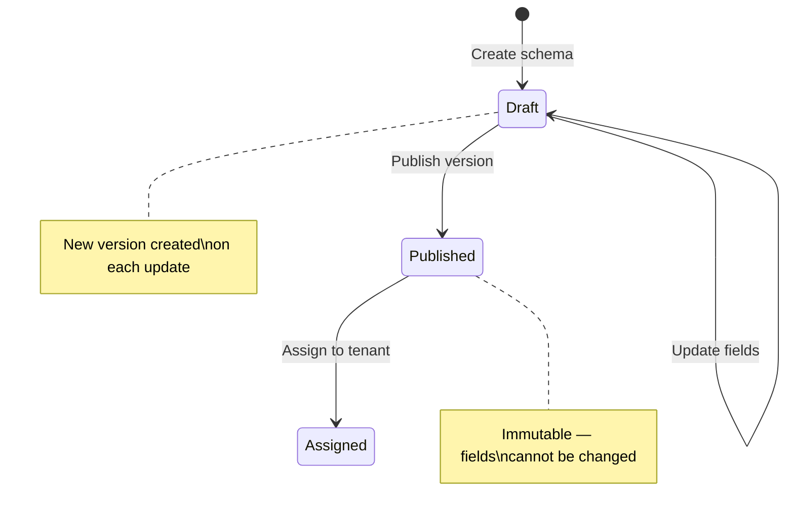

# Schemas & Fields

A **schema** defines the structure of a configuration — what fields exist, their types, constraints, defaults, and cross-field rules. Schemas enforce consistency: every config value must belong to a field defined in the schema, with the right type and within the declared constraints.

> **Alpha Software** — OpenDecree is under active development. The schema format may change without notice between versions. Not recommended for production use yet.

For the canonical format reference (every key, every constraint, every option), see [Schema Format](schema-format.md). For the JSON Schema 2020-12 meta-schema and how to use it in your own tooling, see [Meta-schema](meta-schema.md).

## Schema lifecycle



1. **Create** — define fields, types, and constraints. Creates version 1 as a draft.
2. **Update** — add, modify, or remove fields. Each update creates a new draft version.
3. **Publish** — mark a version as immutable. Only published versions can be assigned to tenants.
4. **Assign** — create a tenant bound to a published schema version.

Published versions are immutable — you cannot change their fields. To evolve a schema, create a new version and publish it. See [Versioning](versioning.md) for the version-evolution semantics.

## Quick example

A small schema in YAML:

```yaml
# yaml-language-server: $schema=https://schemas.opendecree.dev/schema/v0.1.0/decree-schema.json
spec_version: v1
name: payments
description: Payment processing configuration

fields:
  payments.enabled:
    type: bool
    description: Whether payment processing is active
    default: "true"

  payments.fee_rate:
    type: number
    description: Fee percentage per transaction
    nullable: true
    constraints:
      minimum: 0
      maximum: 1

  payments.currency:
    type: string
    description: Default settlement currency
    constraints:
      enum: [USD, EUR, GBP]

  payments.timeout:
    type: duration
    description: Payment processing timeout
```

The first-line `# yaml-language-server:` modeline tells editors with [yaml-language-server](https://github.com/redhat-developer/yaml-language-server) to auto-apply the [meta-schema](meta-schema.md) for IntelliSense and inline error highlighting.

For the full set of supported keys, types, constraints, and cross-field rule mechanisms (`dependentRequired`, `validations`), see the [Schema Format reference](schema-format.md).

## Strict mode

When writing config values against a schema, the server operates in **strict mode**: writes to field paths not defined in the tenant's schema are rejected. This prevents typos and undeclared fields from entering the config.

## Field types in brief

Fields are typed — every field declares one of eight types that controls wire encoding and validation:

`integer`, `number`, `string`, `bool`, `time`, `duration`, `url`, `json`.

See [Typed Values](typed-values.md) for the wire-level `TypedValue` oneof and [Schema Format — Field types](schema-format.md#field-types) for the full type table.

## Cross-field rules in brief

Two complementary mechanisms cover cross-field invariants:

- **`dependentRequired:`** — declarative "if A is set, B must also be set". Free, no expression engine. Use for the simple cases.
- **`validations:`** — reserved for cross-field rules expressed in [CEL](https://github.com/google/cel-spec). Use for arithmetic comparisons (`min < max`) and other invariants `dependentRequired` cannot express. The runtime engine ships in Phase 2; v0.1.0 reserves the key.

See [Schema Format — Cross-field rules](schema-format.md#cross-field-rules) for syntax and semantics.

## Related

- [Schema Format](schema-format.md) — full format reference.
- [Meta-schema](meta-schema.md) — JSON Schema 2020-12 meta-schema and how to use it in your tools.
- [Typed Values](typed-values.md) — the wire-level `TypedValue` type system.
- [Tenants](tenants.md) — how schemas are assigned to tenants.
- [Versioning](versioning.md) — schema-version evolution.
- [API Reference — SchemaService](../api/api-reference.md) — full RPC details.
- [CLI — `decree schema`](../cli/decree_schema.md) — managing schemas from the command line.
